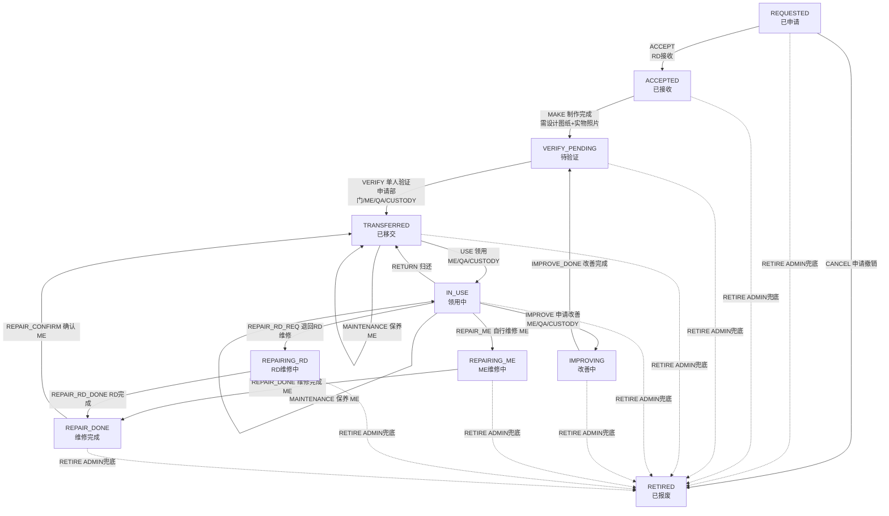

# 治具管理子系统 · 业务流程流程图报告

- 版本：1.0（基于 2026-09-02 全量修复后状态机，manifest 28 条转移）
- 范围：治具申请 → 制作 → 验证移交 → 领用 → 维修/改善 → 报废全流程
- 子系统状态：`deployed:false`（未上线，已具备上线条件）

---

## 一、主流程（Mermaid 流程图）



## 二、历史/兼容状态（存量数据兜底）

```mermaid
flowchart TD
    V1[VERIFY_RD_OK<br/>RD验证通过(旧双人验证)] -->|FORCE_TRANSFER 强制移交 ADMIN| D[TRANSFERRED 已移交]
    V2[VERIFY_ORG_OK<br/>申请单位验证(旧)] -->|FORCE_TRANSFER 强制移交 ADMIN| D
    V1 -->|RETIRE ADMIN| R[RETIRED 已报废]
    V2 -->|RETIRE ADMIN| R
```

---

## 三、动作 / 状态 / 角色对照表

| 当前状态 | 动作 | 目标状态 | 允许角色 |
|---|---|---|---|
| REQUESTED | ACCEPT | ACCEPTED | RD |
| REQUESTED | CANCEL | RETIRED | 申请人 |
| REQUESTED | RETIRE | RETIRED | ADMIN（兜底） |
| ACCEPTED | MAKE | VERIFY_PENDING | RD（需设计图纸+实物照片） |
| VERIFY_PENDING | VERIFY | TRANSFERRED | ME/QA/CUSTODY / 申请部门人员 |
| TRANSFERRED | USE | IN_USE | ME/QA/CUSTODY |
| TRANSFERRED | MAINTENANCE | TRANSFERRED（自环） | ME |
| IN_USE | RETURN | TRANSFERRED | ME/QA/CUSTODY |
| IN_USE | REPAIR_ME | REPAIRING_ME | ME |
| IN_USE | REPAIR_RD_REQ | REPAIRING_RD | ME/QA/CUSTODY |
| IN_USE | IMPROVE | IMPROVING | ME/QA/CUSTODY |
| IN_USE | MAINTENANCE | IN_USE（自环） | ME |
| REPAIRING_ME | REPAIR_DONE | REPAIR_DONE | ME |
| REPAIRING_RD | REPAIR_RD_DONE | REPAIR_DONE | RD |
| REPAIR_DONE | REPAIR_CONFIRM | TRANSFERRED | ME |
| IMPROVING | IMPROVE_DONE | VERIFY_PENDING | ME/QA/CUSTODY |
| VERIFY_RD_OK / VERIFY_ORG_OK | FORCE_TRANSFER | TRANSFERRED | ADMIN（存量兜底） |
| 任意状态 | RETIRE | RETIRED | ADMIN（报废兜底） |

## 四、状态一览

| 状态 | 中文 | 说明 |
|---|---|---|
| REQUESTED | 已申请 | 治具申请创建后初始状态 |
| ACCEPTED | 已接收 | RD 接收申请，进入制作 |
| VERIFY_PENDING | 待验证 | 制作完成，等待单人验证移交 |
| VERIFY_RD_OK / VERIFY_ORG_OK | RD验证通过 / 申请单位确认 | 旧双人验证历史状态（存量兼容，ADMIN 可强制移交/报废） |
| TRANSFERRED | 已移交 | 验证通过，可领用/保养/报废 |
| IN_USE | 领用中 | 现场使用中，可归还/维修/改善/保养 |
| IMPROVING | 改善中 | 治具改善流程，完成后复验 |
| REPAIRING_ME / REPAIRING_RD | ME维修中 / RD维修中 | 两条维修路径 |
| REPAIR_DONE | 维修完成 | 待 ME 确认后移交 |
| RETIRED | 已报废 | 废弃状态 |

---

## 五、关键业务规则

1. **验证 = 单人验证**：申请部门人员 或 ME/QA/CUSTODY 即可验证移交（无 RD 双人验证环节）
2. **制作前置条件**：MAKE 须先上传**设计图纸**（design_drawing）+ **实物照片**（fixture_photo），服务端校验
3. **维修双路径对称**：ME 自行维修 / RD 维修，均经 `REPAIR_DONE` 待 **ME 确认**后移交
4. **改善闭环**：改善完成 → 回到 `VERIFY_PENDING` 复验（非直接报废）
5. **保养**：仅 ME 操作（TRANSFERRED/IN_USE）；新建时设周期即初始化下次保养日
6. **ADMIN 兜底**：旧双人验证死锁状态可强制移交；任意卡死状态（申请/维修中/待确认）可报废
7. **并发保护**：全链路乐观锁 CAS，双人同扫后到者 409
8. **附件生命周期**：设计图纸/请购单/实物照片（ACCEPTED+RD）、验证照片（VERIFY_PENDING）、维修照片（维修中）、保养照片（TRANSFERRED/IN_USE+ME）

## 六、责任主体矩阵

| 阶段 | 责任方 | 主要职责 |
|---|---|---|
| 申请 / 制作 / 维修(RD) | 研发工程(RD) | 建申请、接收、制作、RD维修 |
| 移交 / 领用 / 报修 | 各部门保管(CUSTODY) | 验证移交、领用、归还、报修 |
| 验证 / 领用 / 报修 | 品保(QA) | 验证移交、领用、报修 |
| 保养 / 维修 / 验证 | 生技部(ME) | 验证、领用、归还、保养、自修、确认维修 |
| 系统管理 | 管理员(ADMIN) | 全局查看、报废兜底、强制移交 |

---

*本文档由治具子系统全量修复后的状态机（`subsystems/fixtures/manifest.json` 28 条转移）生成，与实际实现一致。*
